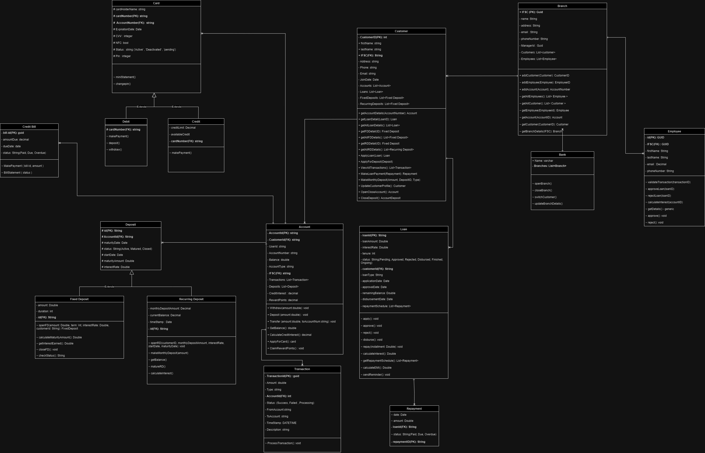

## Banking System Class Diagram
 

 
## Sequence Diagram
 

 Transaction

 

 

 

 Loan 

 

 

 

 Fixed Deposit 

 

 

 

 Reccuring Deposit 

 

 

 
### Overview
 
The system includes classes for managing customers, accounts, branches, employees, loans, deposits, and transactions. Each class has its own attributes and methods to facilitate different operations within the banking system.
 
### Classes and Descriptions
 
#### 1. **Customer**
 
- **Attributes:**
  - customerID (PK): int
  - firstName: string
  - lastName: string
  - SSN: string
  - address: string
  - phone: string
  - email: string
  - accounts: List<Account>
  - loans: List<Loan>
  - fixedDeposits: List<FixedDeposit>
  - recurringDeposits: List<RecurringDeposit>
- **Methods:**
  - getAccounts(): List<Account>
  - getLoanDetails(): List<Loan>
  - applyLoan(Loan): Loan
  - openAccount(Account): Account
  - closeAccount(Account): bool
  - makeDeposit(Deposit): void
  - makeWithdrawal(Transaction): void
  - makeRepayment(Repayment): void
  - updateCustomerDetails(Customer): void
 
#### 2. **Account**
 
- **Attributes:**
  - accountID (PK): string
  - accountNumber: string
  - accountType: string
  - balance: double
  - IFSC: string
  - transactions: List<Transaction>
  - deposits: List<Deposit>
- **Methods:**
  - withdraw(amount: double): void
  - deposit(amount: double): void
  - getBalance(): double
  - getAccountDetails(): Account
  - applyCard(Card): void
  - closeAccount(): void
 
#### 3. **Branch**
 
- **Attributes:**
  - IFSC (PK): string
  - name: string
  - address: string
  - phoneNumber: string
  - manager: GUID
  - customers: List<Customer>
  - employees: List<Employee>
- **Methods:**
  - addCustomer(Customer): void
  - addEmployee(Employee): void
  - addAccount(Account): void
  - addLoan(Loan): void
  - getCustomers(): List<Customer>
  - getAccounts(): List<Account>
  - getLoans(): List<Loan>
 
#### 4. **Employee**
 
- **Attributes:**
  - employeeID (PK): GUID
  - IFSC: string
  - firstName: string
  - lastName: string
  - email: string
  - phoneNumber: string
- **Methods:**
  - validateTransaction(Transaction): void
  - requestApproval(): void
  - createCustomer(Customer): void
  - updateCustomer(Customer): void
  - helpCustomer(): void
 
#### 5. **Loan**
 
- **Attributes:**
  - loanID (PK): string
  - loanAmount: double
  - interestRate: double
  - tenure: int
  - status: string
  - customerID: string
  - applicationDate: date
  - approvalDate: date
  - repayments: List<Repayment>
- **Methods:**
  - requestLoan(): void
  - approve(): void
  - reject(): void
  - disburse(): void
  - makeRepayment(Repayment): void
  - closeLoan(): void
 
#### 6. **Deposit**
 
- **Attributes:**
  - depositID (PK): string
  - accountNumber: string
  - openDate: date
  - status: string
  - maturityDate: date
  - principalAmount: double
  - interestRate: double
 
#### 7. **Fixed Deposit (inherits Deposit)**
 
- **Attributes:**
  - amount: double
  - tenure: int
  - maturityAmount: double
  - penalty: double
- **Methods:**
  - calculateMaturityAmount(): double
  - breakFD(): void
 
#### 8. **Recurring Deposit (inherits Deposit)**
 
- **Attributes:**
  - monthlyDepositAmount: double
  - tenure: int
  - maturityAmount: double
- **Methods:**
  - calculateMaturityAmount(): double
 
#### 9. **Transaction**
 
- **Attributes:**
  - transactionID (PK): string
  - amount: double
  - type: string
  - accountID: string
  - status: string
  - transactionDate: date
- **Methods:**
  - processTransaction(): void
 
#### 10. **Card**
 
- **Attributes:**
  - cardID (PK): string
  - cardNumber: string
  - accountNumber: string
  - expirationDate: date
  - CVV: int
  - PIN: int
  - status: string
- **Methods:**
  - activate(): void
  - deactivate(): void
  - changePin(int): void
 
#### 11. **Credit Card (inherits Card)**
 
- **Attributes:**
  - billAmount: double
  - minDueAmount: double
  - dueDate: date
  - limit: double
- **Methods:**
  - makePayment(): void
  - block(): void
 
#### 12. **Debit Card (inherits Card)**
 
- **Attributes:**
  - dailyLimit: double
- **Methods:**
  - makePayment(): void
 
#### 13. **Repayment**
 
- **Attributes:**
  - repaymentID (PK): string
  - date: date
  - amount: double
  - status: string
- **Methods:**
  - makePayment(): void
 
### Dependencies and Relationships
 
- **Customer** has multiple **Account**, **Loan**, **FixedDeposit**, and **RecurringDeposit**.
- **Branch** manages multiple **Customer** and **Employee**.
- **Account** holds multiple **Transaction** and **Deposit**.
- **Loan** has multiple **Repayment**.
- **Deposit** is a superclass for **FixedDeposit** and **RecurringDeposit**.
- **Card** is a superclass for **CreditCard** and **DebitCard**.
 
 
## Banking System Transactions Sequence Diagram
 
This document provides an overview of the banking system transactions as illustrated in the provided sequence diagram.
 
#### 1. **Entities Involved**
- **Customer:** Initiates transactions such as withdrawals or deposits.
- **Bank Employee:** Assists in initiating transactions at the branch.
- **ATM:** Automated Teller Machine used by customers for transactions.
- **Bank System:** Backend system that validates and processes transactions.
- **Online Banking:** Platform for conducting banking transactions online.
 
#### 2. **Transaction Process**
The sequence diagram depicts two primary transaction scenarios: ATM transactions and general transactions. Each scenario involves multiple steps to ensure the transaction is completed successfully. Below is a step-by-step explanation of each process.
 
### 3. **ATM Transaction Process**
 
1. **Customer Initiates Transaction:**
   - The customer initiates a transaction (withdrawal or deposit) at the ATM.
 
2. **Validate Transaction:**
   - The ATM validates the transaction by communicating with the Bank System.
   - The Bank System checks the customer's account details and ensures there are sufficient funds (for withdrawals).
 
3. **Withdraw/Deposit:**
   - Upon successful validation, the ATM completes the transaction (withdrawal or deposit).
 
4. **Transaction Success:**
   - The ATM confirms the transaction's success to the customer.
 
5. **Log Transaction:**
   - The transaction details are logged in the Bank System.
 
### 4. **General Transaction Process**
 
1. **Initiate Transaction:**
   - The transaction can be initiated by either a customer at a bank branch with the help of a Bank Employee or through Online Banking.
 
2. **Validate Transaction:**
   - The Bank System validates the transaction request by checking the customer's account details and ensuring there are sufficient funds.
 
3. **Process Transaction:**
   - The Bank System processes the transaction accordingly.
 
4. **Transaction Success:**
   - The system confirms the transaction's success and provides the details to the customer.
 
5. **Review and Provide Logs:**
   - The Bank System reviews transaction logs and provides them upon request for auditing or customer inquiries.
 
### 5. **Additional Details**
 
- **Check Account Details:** Ensures the account is active and not flagged for any irregularities.
- **Check Sufficient Funds:** Ensures that the account has enough balance for withdrawal transactions.
- **Process Transaction:** Executes the transaction in the Bank System, updating the account balance accordingly.
- **Transaction Logs:** Detailed logs of each transaction are maintained for auditing and customer service purposes.
 
### 6. **Usage Instructions**
 
- **For Customers:**
  - Ensure you have your account details and necessary authentication (PIN, password) ready when performing transactions.
  - Use ATM or Online Banking for quick and convenient transactions.
 
- **For Bank Employees:**
  - Assist customers with transactions and ensure they have all necessary information.
  - Verify transaction success and provide customers with receipts or confirmations.
 
 
## Loan Management Process Sequence Diagram
 
The loan management process depicted in the sequence diagram involves multiple entities, including the customer, bank system, loan officer, and account. The process can be broken down into several key stages: applying for a loan, reviewing and approving/rejecting the application, disbursing the loan, and managing repayment.
 
#### Entities Involved:
1. **Customer**
2. **Bank System**
3. **Loan Officer**
4. **Account**
 
#### Process Overview:
 
1. **Applying for a Loan:**
   - **Customer:** Initiates the process by applying for a loan.
   - **Bank System:** Receives the loan application.
 
2. **Reviewing Application:**
   - **Loan Officer:** Reviews the application.
   - **Bank System:** Checks the creditworthiness of the customer.
     - If the loan is approved:
       - **Loan Officer:** Approves the loan.
       - **Bank System:** Notifies the approval and disburses the loan.
       - **Customer:** Receives the notification of approval and the disbursed loan.
     - If the loan is rejected:
       - **Loan Officer:** Rejects the loan.
       - **Bank System:** Notifies the rejection.
       - **Customer:** Receives the notification of rejection.
 
3. **Repayment Schedule:**
   - **Customer:** Repays the loan in installments according to the repayment schedule.
   - **Bank System:** Receives loan installment payments and notifies payment receipts.
 
4. **Handling Failed Payments:**
   - If the customer fails to pay:
     - **Bank System:** Checks the bank balance.
     - **Customer:** Is required to repay the loan with the balance available.
     - **Bank System:** Notifies repayment details.
     - **Account:** Decreases credit score and imposes penalty charges.
     - **Bank System:** Notifies the loan repayment status.
 
## Recurring Deposits (RD) Process Sequence Diagram
 
This document provides an overview of the Recurring Deposits (RD) process as depicted in the sequence diagram. The RD process involves multiple entities, including the customer, bank system, and bank employee. The process can be broken down into several stages: inquiring about RD, opening an RD account, making monthly deposits, handling overdue deposits, calculating interest, and managing account closure.
 
#### Entities Involved:
1. **Customer**
2. **Bank System**
3. **Bank Employee**
 
#### Process Overview:
 
1. **Inquiring about RD:**
   - **Customer:** Inquires about RD options.
   - **Bank System:** Fetches and provides RD details to the customer.
   - **Bank Employee:** Explains RD details to the customer.
   - **Customer:** Decides on the deposit amount and term.
 
2. **Opening an RD Account:**
   - **Customer:** Requests to open an RD account.
   - **Bank System:** Opens the RD account.
   - **Bank Employee:** Confirms the RD account opening.
   - **Customer:** Receives confirmation that the RD account is opened.
 
3. **Monthly Deposit:**
   - **Customer:** Makes monthly deposits.
   - **Bank System:** Confirms each deposit.
 
4. **Handling Overdue Deposits:**
   - If a monthly deposit is overdue:
     - **Bank System:** Checks the account balance.
     - If there are sufficient funds:
       - **Bank System:** Deducts the deposit amount and notifies the deposit.
     - If there are insufficient funds:
       - **Bank System:** Imposes a penalty and notifies the status.
   - If consecutive payments fail:
     - **Bank System:** Notifies the customer and closes the RD account with a penalty.
     - **Customer:** Receives notification of the closing.
 
5. **Interest Calculation:**
   - **Bank System:** Periodically calculates the interest and notifies the customer when interest is added.
 
6. **Account Closure:**
   - On Maturity:
     - **Bank System:** Returns the total amount (deposits + interest) to the customer.
   - Premature Closure:
     - **Customer:** Requests premature closure of the RD account.
     - **Bank System:** Processes the premature closure and returns the amount after deducting any penalties.
 
## Fixed Deposits (FD) Process Sequence Diagram
 
This document provides an overview of the Fixed Deposits (FD) process as depicted in the sequence diagram. The FD process involves multiple entities, including the customer, bank system, and bank employee. The process can be broken down into several stages: deciding on the amount and term, opening an FD account, calculating interest, and managing account maturity and premature withdrawal.
 
#### Entities Involved:
1. **Customer**
2. **Bank System**
3. **Bank Employee**
 
#### Process Overview:
 
1. **Deciding on Amount and Term:**
   - **Customer:** Decides on the deposit amount and term for the FD.
 
2. **Opening an FD Account:**
   - **Customer:** Requests to open an FD account.
   - **Bank System:** Opens the FD account.
   - **Bank Employee:** Provides FD account details and confirms the account opening.
   - **Customer:** Receives notification that the FD account is opened and deposits the amount.
 
3. **Interest Calculation:**
   - **Bank System:** Periodically calculates the interest on the FD.
   - **Bank System:** Adds the calculated interest to the principal amount.
 
4. **Account Maturity and Payout:**
   - On Maturity:
     - **Bank System:** Notifies the customer about the maturity of the FD.
     - **Bank System:** Transfers the payout (principal + interest) to the customer.
 
5. **Premature Withdrawal:**
   - **Customer:** Requests premature withdrawal of the FD.
   - **Bank System:** Processes the premature withdrawal.
   - **Bank System:** Transfers the principal and interest amount to the customer after deducting any applicable penalties.
 
 
 
## Contributors
 
- **Utpal Tripati** - [Team Member](https://github.com/100-UtpalTripathi)
- **Venkat SP** - [Team Member](https://github.com/venkatsp17)
- **Venakata Sujan** - [Team Member](https://github.com/dvsujan)
- **Jaivignesh V** - [Team Member](https://github.com/JaivigneshJv)
 